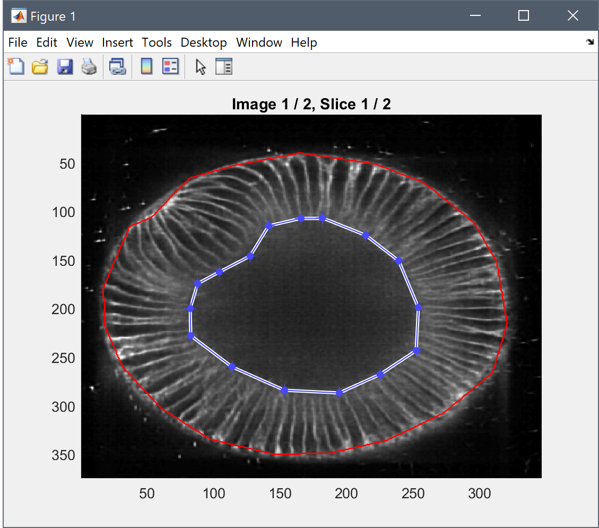
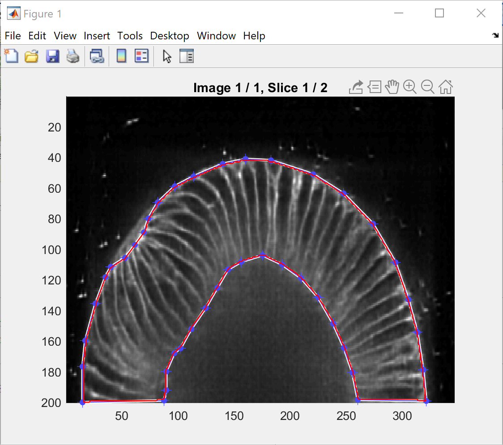

Manual Mask Generation
======================
The scripts contained in this folder are intended to manually create a binary mask for a 3D input image. There are two scripts called *"\*_Complete"* and *"\*_Partial"* for mask generation of a complete or a partial embryo.
The complete script requires two annotations per slice (outer boundary and inner boundary) and the partial script requires one annotation per slice that covers both the outer, inner boundary and the transition between them.

Preprocessing:
--------------
- Images have to be cropped and oriented properly before starting with the masking. For instance, use tools like Fiji (https://fiji.sc) to transform the input images to the correct orientation.
- Orientation should be as follows: anterioposterior axis on the y-axis, the lateral axis on the x-axis and dorsoventral axis on the z-axis.

Masking Procedure:
------------------
1. Open the *"\*_Complete.m"* or *"\*_Partial.m"* script in MATLAB and hit "run" to execute it.

2. Select the number of slices you want to annotate per stack (minimum 2, *i.e.*, the first and last slice. For higher numbers, equally spaced planes in between will be selected automatically and presented for manual mask drawing).
3. Select the folder containing the cropped and properly oriented raw images (results will be placed in a subfolder called *"Results/"* within this folder).
4. Select the method you want to use for mask generation: *Polylines* (default) allows you to draw an arbitrarily precise polygon. *Freehand* allows you to trace a freehand contour (hard to get it precise without pen input, however).

5. Draw the mask for the outer boundary and finish the mask by clicking on the start point again (polylines mode) or by releasing the mouse button (freehand mode).

    5.1 For partial embryos, start on the outer surface, proceed clock-wise with the labeling and continue on the inside couter-clockwise as soon as you reach the image border.

    5.2 For complete embryos, start with the outer boundary and finish it, then proceed separately with the inner boundary.

6. Once the boundaries of the current slice are complete, the script presents the next slice and you can repeat the annotation for this slice. If you're unsatisfied with the results of the current slice, you can also redo the annotation by selecting the option in question dialog.

7. After masking the final slice, the script linearly interpolates the annotations of the different slices to generate a dense mask and applies it to the raw image.

8. The result images are stored in a sub-folder called *"Results"* within the raw image folder with the suffix *"\*_Masked.tif"*.
9. If the input folder containes multiple images, the next image is automatically loaded and you can proceed with the annotation of the next stack.

Notes:
------
- Try to specify the boundary by clicking on the "tips of the membranes", *i.e.*, on the most apical/basal membrane signal that is still sufficiently resolved. 
- If there's no structure visible by eye (*e.g.*, at the basal side), it's probably better to use a smaller mask, shrinked to the well-resolved part of the image. This will, of course, cause an underestimation of the volume measurements but will most likely improve the apical and basal area measurements.

- In addition to simply masking the image, a *safety border* with the maximum intensity is introduced that later on avoids leakage of the background markers to the cells, if a watershed-based segmentation is applied to the images.
- Upon failures, simply close all figures or cancel the labeling process with "CTRL+C" and restart the script. If you hit "Cancel" for the mask generation method, the current stack is skipped and the next stack in the folder is loaded.

- Both the raw images and the masked images are used for the subsequent the manual/automatic segmentation methods. The masked images can also be used for extracting a peel (or isosurface) and to project the 3D peel to a 2D image for visualization and measurement. Performing manual/automatic segmentation on the mask images avoids spurious detections in the background regions.

Examples:
---------
Full Embryo Mask (1 polyline for the outer surface, 1 polyline for the inner surface)

Partial Embryo Mask (1 polyline for both outer and inner surface).
