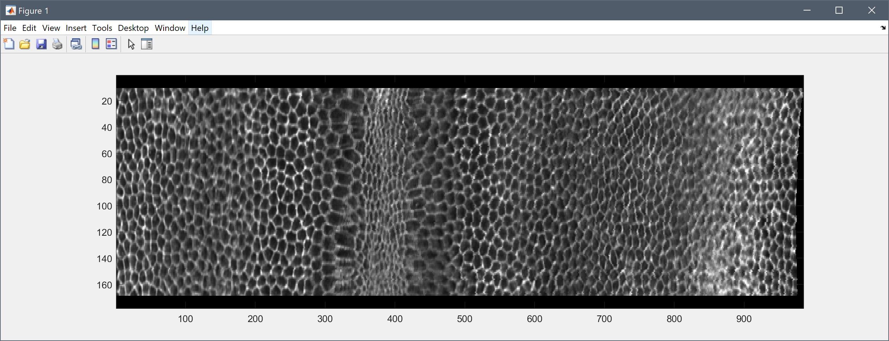
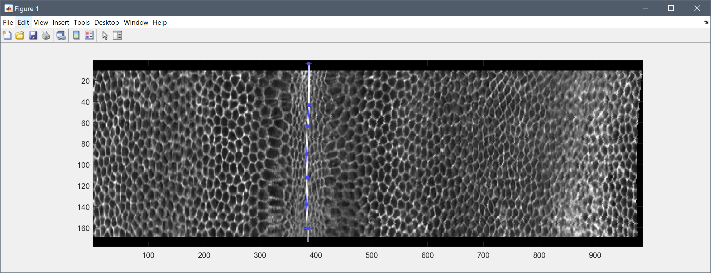
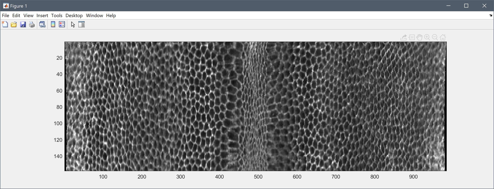

Scripts for extracting peels at a specified distance from the apical and the basal surface of the embryo, respectively. The first script extracts the peel and unwraps it, *i.e.*, it projects the 3D surface to a 2D plane. The second script can be used to align the ventral furrow in the center of the projected 2D image.

Isosurface Extraction and Projection:
-------------------------------------
1.	Start the script *ExtractAndProjectPeel.m* in MATLAB.
2.	Two folder open dialogs should appear. First, select the raw image folder and then the folder containing the masked raw images. The script assumes that you have properly oriented, cropped and masked the embryo, such that anteroposterior points along the y-axis and the dorsoventral axis along the z-axis (as for the mask generation script as well).
3.	The script then extracts the basal and the apical surfaces using the mask and you can control how far the extracted peels should be distant from the mask surface (can be adapted in the first lines of the script). For instance, setting it to *5* would extract both apical and basal peels 5 pixels apart from the outer and the inner mask surface, respectively.
4.	Finally, the produces two outputs (*\*_basalPeel.png* and *\*_apicalPeel.png*) that are the final results. The examples below show two examples of such peels. 
5. The peels are extracted by simply traversing the surface pixel by pixel and to obtain true proportions in the projected images, the 3D images should be isotropic. If this precondition is not met, the the appearance of the projection might be distorted. However, this can be simply compensated by axially stretching the images to be isotropic. 

Rectify Peel Images:
--------------------
To compensate for the more or less arbitrary orientation of the embryo in the 3D images, the script *RectifyPeelImage.m* can be used to align the ventral furrow (or other structures of interest) in the center of the projected image. To align a peel image, perform the following steps:

1. Execute the script *RectifyPeelImage.m*
2. Load the peel image obtained with the steps described above (expects *\*.png* format, but can be easily changed in the second line, if you prefer a different image format).
3. The script adds a black padding on top and below the image. Start on top in the black area and add click points along the ventral furrow. Finish the line drawing with a double-click for the final point in the black area on the bottom.
4. The script automatically centers the furrow according to the line, wraps the parts of the image on the left and right of the furrow, such that it's equally distributed around the center and crops the black border.
5. The result is saved as another image called *\*_rectified.png* next to the input image.

Example:
--------

Result image of the apical peel extraction:

Drawing the rectification line along the ventral furrow:

Final rectified image with the furrow in the image center:
